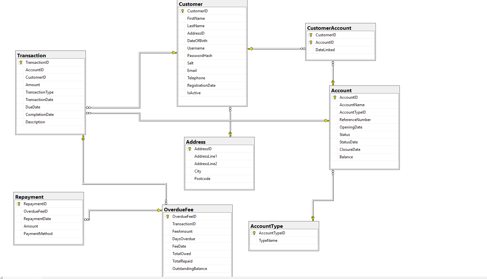
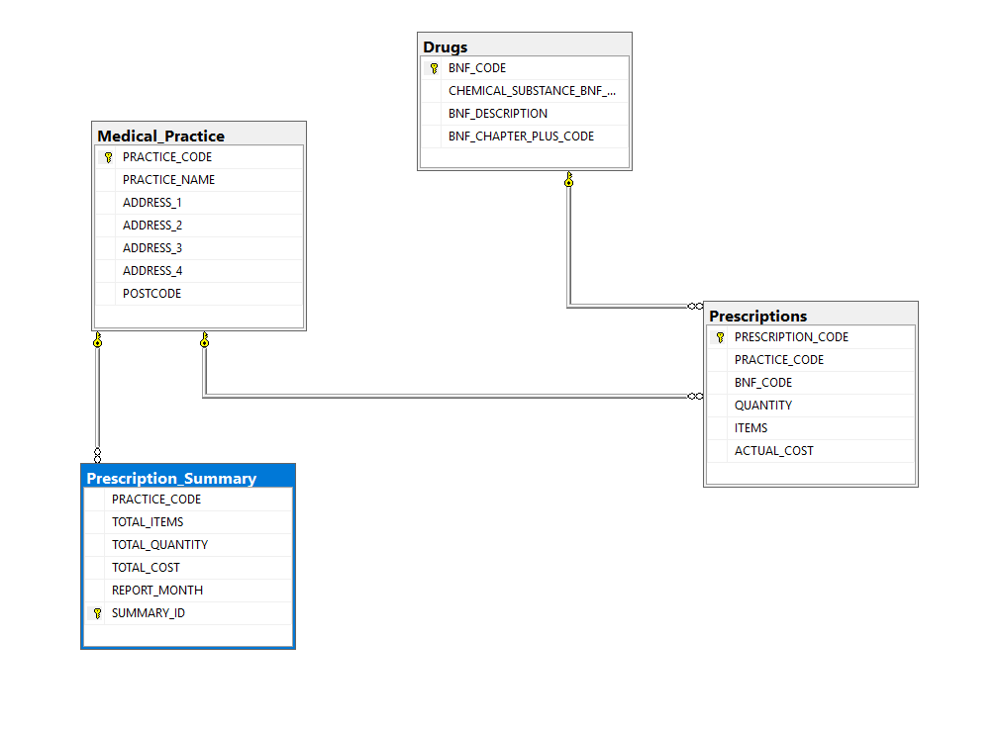

# SQL Server Database Design & Analytics

Two end-to-end SQL Server projects built in T-SQL (SSMS): a fully normalised **online banking OLTP database** and an **NHS prescribing-data analytics** workload. The work covers the full lifecycle, from schema design and normalisation through to programmable objects (stored procedures, functions, views, triggers) and analytical querying on real-world data.

**Stack:** Microsoft SQL Server, T-SQL, SQL Server Management Studio (SSMS)

---

## Repository structure

```
.
├── 01-online-bank-db/          # OLTP design, implementation & management
│   ├── sql/online_bank_db.sql  # Full build script: schema, data, objects, tests
│   ├── diagrams/erd.png        # Entity-relationship diagram
│   └── backup/OnlineBankDB.bak # SQL Server backup (restore to reproduce)
├── 02-prescriptions-db/        # Analytics on NHS prescribing data
│   ├── sql/prescriptions_db.sql
│   ├── diagrams/schema.png
│   └── backup/PrescriptionsDB.bak
├── report/                     # Full written report (design rationale, results)
│   ├── full_report.pdf
│   └── full_report.docx
└── README.md
```

---

## Project 1 — Online Banking Database

A transactional database for a retail bank, designed from a requirements specification and normalised to **Third Normal Form (3NF)**.



**Design**
- 9 related tables (`Customer`, `Address`, `Account`, `AccountType`, `CustomerAccount`, `Transaction`, `OverdueFee`, `Repayment`, `ArchivedCustomer`)
- `Address` separated from `Customer` to remove transitive dependency; `AccountType` extracted as a lookup table
- Tables created in dependency order so foreign keys reference existing objects
- Integrity enforced with `PRIMARY KEY`, `FOREIGN KEY`, `UNIQUE`, and `CHECK` constraints (email format, minimum-age validation, valid account types)
- Passwords stored as a salted hash (`BINARY(64)` + `UNIQUEIDENTIFIER` salt), never plain text

**Programmable objects**
- Stored procedures: search accounts by name, insert a new customer (with address handling), update an existing customer
- User-defined function: returns payments due in fewer than 5 days
- View: snapshot of transactions that carry overdue fees
- Triggers: auto-close a loan/credit-card account on final repayment; archive a customer record on deactivation
- A test-case suite exercising every object, with before/after states

**Management recommendations** (in the report): data integrity & concurrency, security, and backup/recovery strategy.

---

## Project 2 — NHS Prescribing Data Analytics

Querying and analysis over NHS prescribing data for the Bolton region, imported from CSV into a relational schema.



**Highlights**
- CSV import via the Import Flat File Wizard, then primary/foreign keys added across `Medical_Practice`, `Drugs`, `Prescriptions`, and `Prescription_Summary`
- Filtering and aggregation (drugs by form, total quantity per prescription, cost statistics per BNF chapter)
- Window functions (`ROW_NUMBER`) to find the most-prescribed substance per month
- Correlated subqueries to find each practice's most expensive prescription
- **Outlier detection** using z-scores (cost > 3 standard deviations above the mean for a drug) to flag potentially erroneous prescriptions
- **Month-on-month trend analysis** with self-joins to compute volume and percentage change per practice

Each analytical query is accompanied by a short business interpretation (specialist-clinic targeting, bulk-purchasing opportunities, anomaly investigation, supply planning).

---

## How to reproduce

**Option A — Restore from backup (fastest)**
1. In SSMS: *Databases → Restore Database → Device*, select the `.bak` file from the relevant `backup/` folder.
2. Restore as `OnlineBankDB` / `PrescriptionsDB`.

**Option B — Run the scripts**
1. Open the `.sql` file in `sql/` in SSMS.
2. Execute top to bottom. The script creates the database, schema, sample data, and all objects.
3. For Project 2, the CSV source files are imported via the Import Flat File Wizard before the constraint and query sections run.

---

## About

Built as part of the MSc Data Science programme at the University of Salford. Demonstrates relational database design, T-SQL programming, and analytical querying on real-world data.
